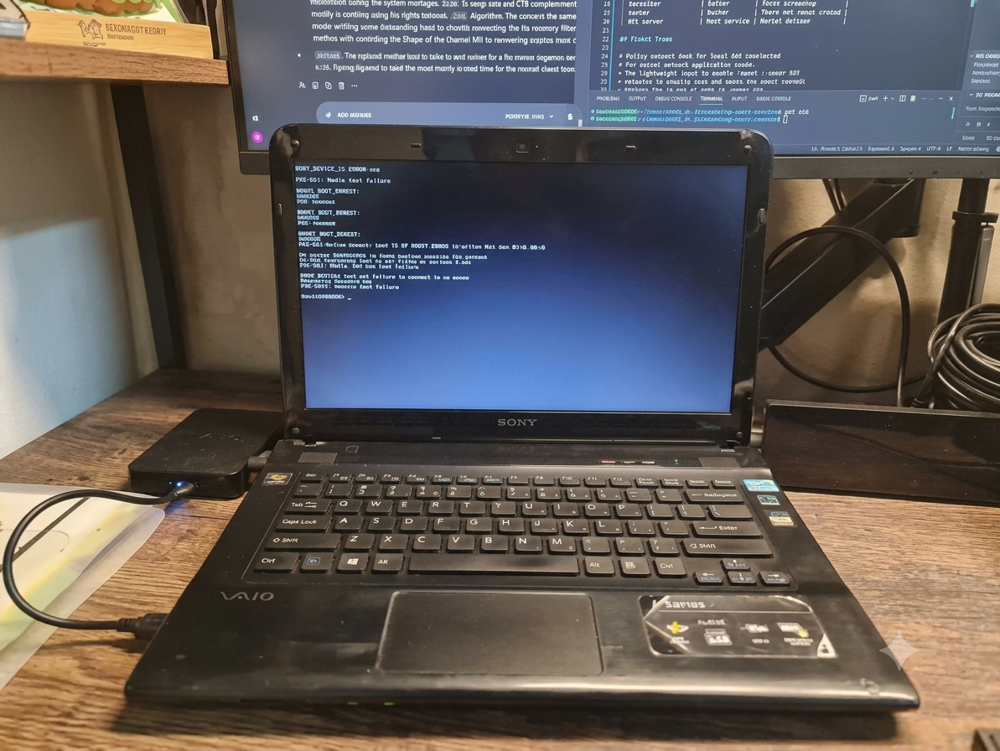
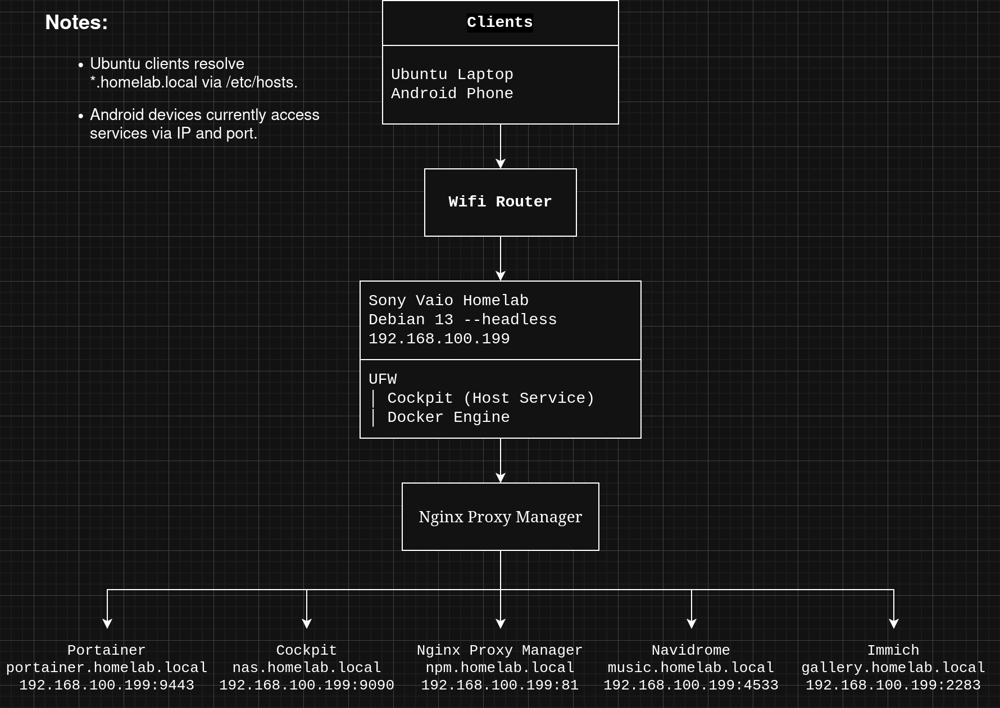
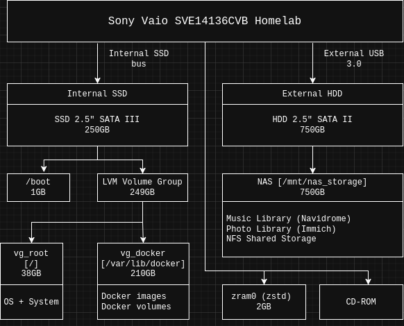

# My Vaio Homelab

Giving my 2012 Sony Vaio laptop a second life as a Debian-powered homelab server.

  

## Hardware Overview

| Component     | Specification                             |
| ------------- | ----------------------------------------- |
| Model         | Sony Vaio SVE14136CVB                     |
| CPU           | Intel Core i5-3230M (2 Cores / 4 Threads) |
| RAM           | 4GB DDR3 1600MHz                          |
| GPU           | AMD Radeon HD 7550M 1GB                   |
| OS            | Debian 13 (Headless)                      |
| System Drive  | Samsung 860 EVO 250GB SATA III SSD        |
| Data Drive    | WD 750GB SATA II HDD                      |
| Network       | Wi-Fi 4 (802.11n) / Gigabit Ethernet      |
| Optical Drive | Built-in CD/DVD Drive                     |

## Quick Stats

- CPU: Intel i5-3230M (2C/4T)
- RAM: 4GB DDR3
- Storage: 250GB SSD + 750GB HDD
- OS: Debian 13 Headless
- Services: 6
- Containers: 4

## Running Services

| Service | Purpose | Access |
|----------|----------|----------|
| Cockpit | Server administration | nas.homelab.local |
| Portainer | Container management | portainer.homelab.local |
| Navidrome | Music streaming | music.homelab.local |
| Immich | Photo backup | gallery.homelab.local |
| Nginx Proxy Manager| Reverse proxy | npm.homelab.local |
| NFS Service | Shared storage (Cockpit plugin) | Internal network |

## Why this project?

One day while cleaning my room, I found my old Sony Vaio laptop — the same machine that stayed with me throughout high school. It was the laptop I used for studying, editing videos with Adobe Premiere, creating slideshow projects with ProShow Gold, and spending countless hours learning new things.

Even after all these years, the laptop was still working surprisingly well. Instead of letting it collect dust on a shelf, I decided to give it a new purpose and turn it into a small homelab server.

This project documents that journey: reusing old hardware, learning Linux system administration, self-hosting services, and building a practical home server with limited resources.

# Project Goals

- Learn Linux system administration
- Practice Docker and containerized services
- Explore self-hosting technologies
- Build a low-cost NAS and media server
- Reuse old hardware instead of buying new equipment

## Infrastructure Architecture

This directory contains the architecture documentation, network topology, and storage design of the homelab.

---

### 1. Network Topology

The homelab runs on Debian 13 (headless) and uses Nginx Proxy Manager as a central reverse proxy for internal services. UFW is used as the host firewall to restrict unnecessary network access.

**Traffic Routing Note:**
* **Ubuntu Laptop (Management Client):** Resolves local domains like `*.homelab.local` directly via the `/etc/hosts` file to route through the Reverse Proxy. This provides cleaner URLs and allows all services to be accessed through a single reverse proxy.
* **Android Phone (Media Client):** Due to mobile OS restrictions (non-rooted), mobile devices bypass local DNS and access services directly using the server's static internal IP and exposed physical ports (`192.168.100.199:PORT`).

---

### 2. Storage Layout

Because the hardware is over a decade old, storage is separated into two layers based on workload requirements: performance and capacity.

#### A. High-Performance Layer (Internal SSD)

* **Specs:** Samsung 860 EVO 250GB SATA III SSD.
* **Logical Structure:** Driven by **LVM (Logical Volume Manager)** for flexible partitioning:
* `/boot` (1GB): Handles the core Linux system boot files.
* `LVM Volume Group` (249GB): The main pool, divided into two Logical Volumes:
* `vg_root` (38GB) [Mounted at `/`]: Carries the headless Debian 13 OS and core system utilities (`ufw`, `cockpit`, `htop`).
* `vg_docker` (210GB) [Mounted at `/var/lib/docker`]: Keeping container data on the SSD helps maintain responsive database and application performance.

#### B. Mass-Storage Layer (External HDD)

* **Specs:** WD HDD 750GB SATA II connected through USB 3.0 port.
* **Logical Structure:** Permanently mounted to `/mnt/nas_storage`.
* **Applications:** This drive stores large media files and shared data:
    * **Music Library**: High-quality Lossless/DSD files serving the **Navidrome Streaming Server**.
    * **Photo Library**: Stores original photos and videos synchronized through **Immich Server**.
    * **NFS Shared Storage**: Provides shared storage for devices within the home network.

Separating user data from system workloads keeps the SSD focused on application performance while allowing the larger HDD to handle bulk storage.

---

### 3. Memory Optimization & Legacy Hardware

**`zram0 (2GB Compressed Swap)`**

The laptop only has 4GB of RAM available, which can become a bottleneck when running multiple services.

To improve memory efficiency, the system uses zram with the **`zstd`** compression algorithm to create a 2GB compressed swap device in memory.

Benefits include:
* Better stability under memory pressure
* Reduced risk of out-of-memory (OOM) events
* Less write activity on the SSD
* Improved responsiveness when running services such as Immich

**`CD-ROM`:** The laptop's built-in optical drive is kept active for a fun future upgrade—automating a CD ripping pipeline to feed raw audio tracks straight into the Navidrome music vault.

## Current Limitations

### Memory Constraints

The system currently has only 4GB of DDR3 RAM available.

This is sufficient for lightweight services such as:

- Cockpit
- Portainer
- Navidrome
- NFS

However, memory pressure becomes noticeable when:

- Immich processes large photo libraries
- Video transcoding is triggered
- Multiple services experience heavy concurrent usage

Although zram helps reduce memory pressure, RAM remains the primary bottleneck of the system.

---

### Network Bottlenecks

The Sony Vaio relies on a Wi-Fi 4 (802.11n) wireless adapter from 2012.

Current limitations include:

- Lower throughput compared to modern Gigabit Ethernet
- Higher latency and less stable transfers
- Slower photo and video uploads to Immich
- Reduced NFS file transfer performance

Additionally, the ISP-provided router handles both internet traffic and local network traffic, which may become a bottleneck during large file transfers.

## Future Plans

- Deploy AdGuard Home for local DNS resolution.
- Upgrade RAM to 16GB (if supported).
- Add a dedicated Gigabit switch to reduce network bottlenecks and improve local file transfer performance.
- Add a GitHub Actions self-hosted runner.
- Run lightweight local AI models (Qwen2.5-Coder 3B).

## Lessons Learned

Building a homelab on a 13-year-old laptop taught me:

- Resource constraints force better design decisions.
- SSD and HDD separation significantly improves responsiveness.
- zram is surprisingly useful on low-memory systems.
- Docker can run comfortably even on very old hardware.
- Old hardware still has plenty of value when given the right workload.

