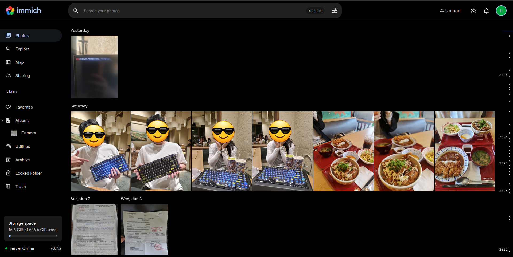
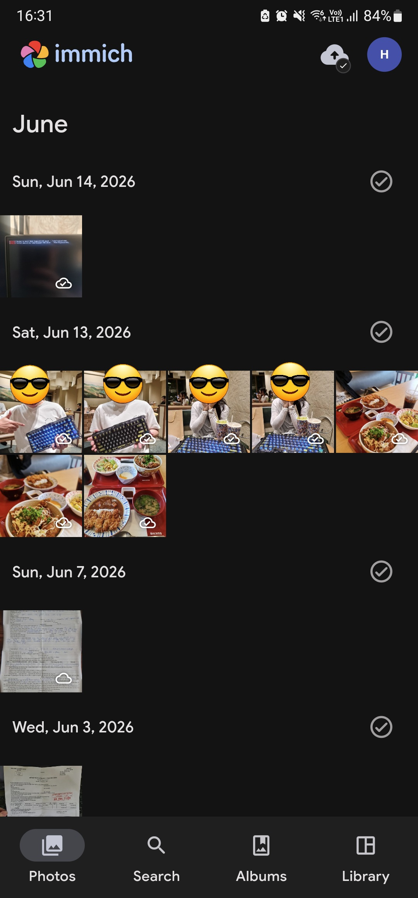
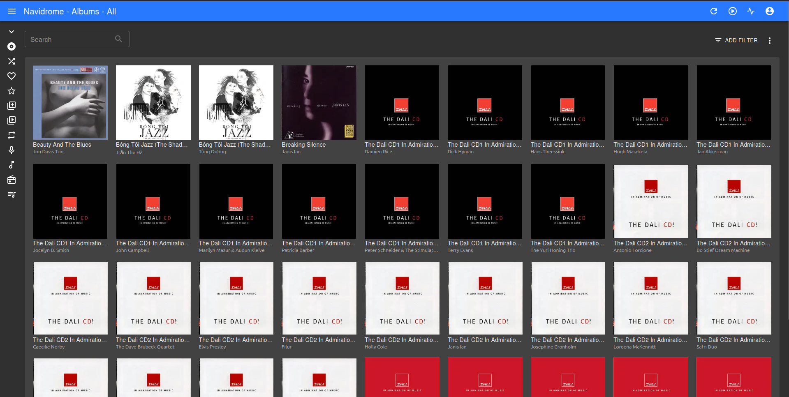
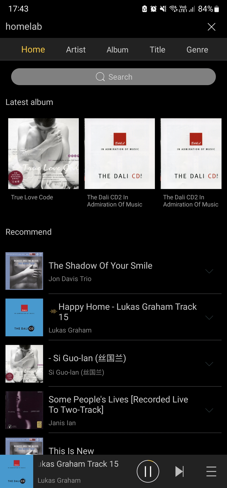
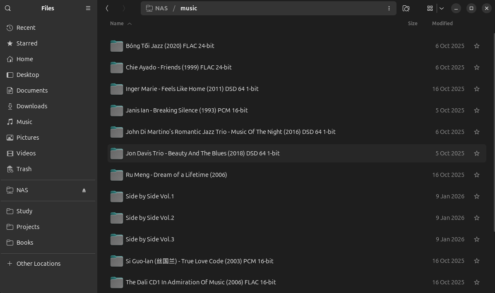
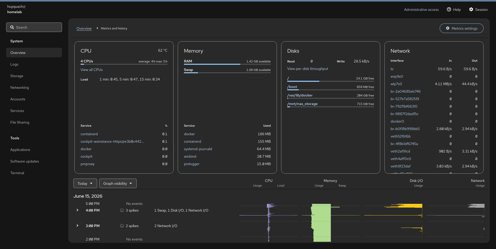
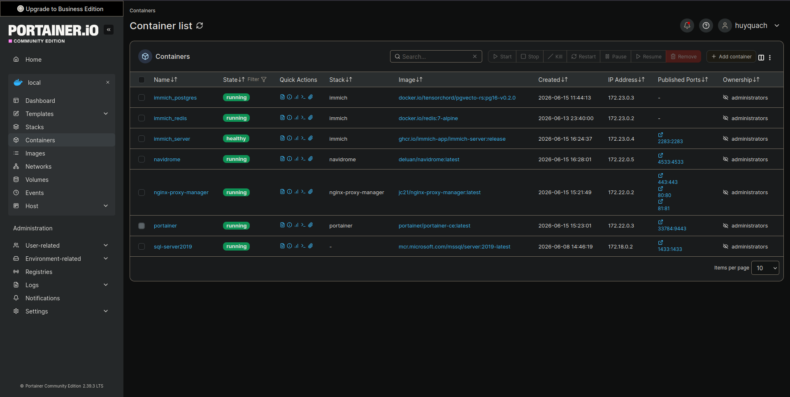
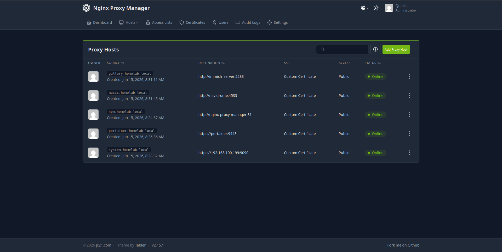

# My Vaio Homelab

Giving my 2012 Sony Vaio laptop a second life as a Debian-powered homelab server.


## Hardware Overview

| Component     | Specification                             |
| ------------- | ----------------------------------------- |
| Model         | Sony Vaio SVE14136CVB                     |
| CPU           | Intel Core i5-3230M (2 Cores / 4 Threads) |
| RAM           | 4GB DDR3 1600MHz                          |
| GPU           | AMD Radeon HD 7550M 1GB                   |
| OS            | Debian 13 (Headless)                      |
| System Drive  | Samsung 860 EVO 250GB SATA III SSD        |
| Data Drive    | WD 750GB SATA II HDD                      |
| Network       | Wi-Fi 4 (802.11n) / Gigabit Ethernet      |
| Optical Drive | Built-in CD/DVD Drive                     |

## Quick Stats

- CPU: Intel i5-3230M (2C/4T)
- RAM: 4GB DDR3
- Storage: 250GB SSD + 750GB HDD
- OS: Debian 13 Headless
- Services: 6
- Containers: 4

## Running Services

| Service | Purpose | Access |
| ---------- | ---------- | ---------- |
| Cockpit | Server administration | system.homelab.local |
| Portainer | Container management | portainer.homelab.local |
| Navidrome | Music streaming | music.homelab.local |
| Immich | Photo backup | gallery.homelab.local |
| Nginx Proxy Manager | Reverse proxy | npm.homelab.local |
| NFS Service | Shared storage (Cockpit plugin) | Internal network |

## Why this project?

One day while cleaning my room, I found my old Sony Vaio laptop — the same machine that stayed with me throughout high school. It was the laptop I used for studying, editing videos with Adobe Premiere, creating slideshow projects with ProShow Gold, and spending countless hours learning new things.

Even after all these years, the laptop was still working surprisingly well. Instead of letting it collect dust on a shelf, I decided to give it a new purpose and turn it into a small homelab server.

This project documents that journey: reusing old hardware, learning Linux system administration, self-hosting services, and building a practical home server with limited resources.

## Project Goals

- Learn Linux system administration
- Practice Docker and containerized services
- Explore self-hosting technologies
- Build a low-cost NAS and media server
- Reuse old hardware instead of buying new equipment

## Infrastructure Architecture

This directory contains the architecture documentation, network topology, and storage design of the homelab.

---

### 1. Network Topology


The homelab runs on Debian 13 (headless) and uses Nginx Proxy Manager as the central reverse proxy for browser-based access. UFW is configured on the host to expose only the ports required for management and media services.

#### Current Access Model

The homelab currently supports two access methods:

##### Browser-Based Access (Desktop/Laptop)

Management and web applications are accessed through Nginx Proxy Manager using custom local domains.

Examples:

- `system.homelab.local` → Cockpit
- `portainer.homelab.local` → Portainer
- `music.homelab.local` → Navidrome
- `gallery.homelab.local` → Immich

Since a dedicated DNS server has not been deployed yet, these domains are resolved through the client machine's `/etc/hosts` file.

Traffic flow:

```text
Client
   │
   ▼
Nginx Proxy Manager (80/443)
   │
   ├── Cockpit
   ├── Portainer
   ├── Navidrome
   └── Immich
```

##### Mobile Application Access (Android)

Android media applications currently connect directly to the homelab using the server's static IP address and exposed service ports.

Examples:

- Immich → `192.168.100.199:2283`
- Navidrome → `192.168.100.199:4533`

This approach is used temporarily because local DNS resolution has not yet been implemented for mobile devices.

Traffic flow:

```text
Android Client
      │
      ├── 192.168.100.199:2283 → Immich
      └── 192.168.100.199:4533 → Navidrome
```

#### Future Network Architecture

The long-term plan is to deploy:

- AdGuard Home (Local DNS)
- Cloudflared Tunnel (Secure Remote Access)
- Public Domain Names
- Automatic HTTPS Certificates

Once local DNS is available, all services can be accessed through domain names and routed entirely through Nginx Proxy Manager, allowing direct service ports such as `2283` and `4533` to be removed from the firewall.

#### Security Considerations

The homelab follows a "minimum exposure" principle.

Most services are accessed through Nginx Proxy Manager and do not require direct port exposure on the host.

Currently, only the following service ports are exposed:

| Service   | Port     | Reason                                      |
|-----------|----------|---------------------------------------------|
| Immich    | 2283     | Android Immich app requires direct access   |
| Navidrome | 4533     | Android music clients require direct access |

All other services remain accessible only through the reverse proxy:

- Cockpit
- Portainer
- Future web applications

This design reduces the attack surface of the homelab while maintaining compatibility with mobile applications.

The direct service ports (`2283`, `4533`) are considered a temporary solution until AdGuard Home is deployed.

Once local DNS is available, Android devices will be able to resolve homelab domains directly, allowing:

```text
Android App
      │
      ▼
music.homelab.local
gallery.homelab.local
      │
      ▼
Nginx Proxy Manager
      │
      ▼
Internal Containers
```

At that point, the direct firewall rules for Immich and Navidrome can be removed, and all traffic will flow through the reverse proxy.

---

### 2. Storage Layout


Because the hardware is over a decade old, storage is separated into two layers based on workload requirements: performance and capacity.

#### A. High-Performance Layer (Internal SSD)

- **Specs:** Samsung 860 EVO 250GB SATA III SSD.
- **Logical Structure:** Driven by **LVM (Logical Volume Manager)** for flexible partitioning:
- `/boot` (1GB): Handles the core Linux system boot files.
- `LVM Volume Group` (249GB): The main pool, divided into two Logical Volumes:
- `vg_root` (38GB) [Mounted at `/`]: Carries the headless Debian 13 OS and core system utilities (`ufw`, `cockpit`, `htop`).
- `vg_docker` (210GB) [Mounted at `/var/lib/docker`]: Keeping container data on the SSD helps maintain responsive database and application performance.

#### B. Mass-Storage Layer (External HDD)

- **Specs:** WD HDD 750GB SATA II connected through USB 3.0 port.
- **Logical Structure:** Permanently mounted to `/mnt/nas_storage`.
- **Applications:** This drive stores large media files and shared data:
  - **Music Library**: High-quality Lossless/DSD files serving the **Navidrome Streaming Server**.
  - **Photo Library**: Stores original photos and videos synchronized through **Immich Server**.
  - **NFS Shared Storage**: Provides shared storage for devices within the home network.

Separating user data from system workloads keeps the SSD focused on application performance while allowing the larger HDD to handle bulk storage.

---

### 3. Memory Optimization & Legacy Hardware

**`zram0 (2GB Compressed Swap)`**

The laptop only has 4GB of RAM available, which can become a bottleneck when running multiple services.

To improve memory efficiency, the system uses zram with the **`zstd`** compression algorithm to create a 2GB compressed swap device in memory.

Benefits include:

- Better stability under memory pressure
- Reduced risk of out-of-memory (OOM) events
- Less write activity on the SSD
- Improved responsiveness when running services such as Immich

**`CD-ROM`:** The laptop's built-in optical drive is kept active for a fun future upgrade—automating a CD ripping pipeline to feed raw audio tracks straight into the Navidrome music vault.

## Current Limitations

### Memory Constraints

The system currently has only 4GB of DDR3 RAM available.

This is sufficient for lightweight services such as:

- Cockpit
- Portainer
- Navidrome
- NFS

However, memory pressure becomes noticeable when:

- Immich processes large photo libraries
- Video transcoding is triggered
- Multiple services experience heavy concurrent usage

Although zram helps reduce memory pressure, RAM remains the primary bottleneck of the system.

---

### Network Bottlenecks

The Sony Vaio relies on a Wi-Fi 4 (802.11n) wireless adapter from 2012.

Current limitations include:

- Lower throughput compared to modern Gigabit Ethernet
- Higher latency and less stable transfers
- Slower photo and video uploads to Immich
- Reduced NFS file transfer performance

Additionally, the ISP-provided router handles both internet traffic and local network traffic, which may become a bottleneck during large file transfers.

### DNS and Service Discovery

The homelab currently does not have a dedicated local DNS server.

As a result:

- Ubuntu management clients must manually maintain `/etc/hosts` entries to resolve local domains such as:
  - `system.homelab.local`
  - `portainer.homelab.local`
  - `music.homelab.local`
  - `gallery.homelab.local`

- Android devices cannot resolve these custom hostnames and must access services directly using:

  ```text
  192.168.100.199:<PORT>
  ```

## Future Plans

- Deploy AdGuard Home for local DNS resolution.
- Upgrade RAM to 16GB (if supported).
- Add a dedicated Gigabit switch to reduce network bottlenecks and improve local file transfer performance.
- Add a GitHub Actions self-hosted runner.
- Run lightweight local AI models (Qwen2.5-Coder 3B).

## Lessons Learned

Building a homelab on a 13-year-old laptop taught me:

- Resource constraints force better design decisions.
- SSD and HDD separation significantly improves responsiveness.
- zram is surprisingly useful on low-memory systems.
- Docker can run comfortably even on very old hardware.
- Old hardware still has plenty of value when given the right workload.

## Homelab Showcase & UI Previews

Here is a visual tour of the running services on the Sony Vaio server, demonstrating both the desktop proxy routing and the direct mobile app access.

### 1. Media & Cloud Services (Dual-View)

#### Immich (Photo Backup Server)

Accessed via secure HTTPS on desktops and direct IP streaming on mobile devices.

<table>
  <tr>
    <td align="center" width="75%">
      <b>Desktop Web UI (https://gallery.homelab.local)</b><br>
      
    </td>
    <td align="center" width="25%">
      <b>Android Mobile App (Direct Port 2283)</b><br>
      
    </td>
  </tr>
</table>

#### Navidrome (Music Streaming Server)

Serving lossless FLAC/DSD audio archives over the local network.

<table>
  <tr>
    <td align="center" width="75%">
      <b>Desktop Web Player (https://music.homelab.local)</b><br>
      
    </td>
    <td align="center" width="25%">
      <b>Android HiByMusic Client (Direct Port 4533)</b><br>
      
    </td>
  </tr>
</table>

---

### 2. Network Attached Storage (NFS Client Mount)

Verification of the host's mass-storage pool mounted directly onto the Ubuntu client desktop file manager via NFS.



---

### 3. Administrative & Infrastructure Services (Desktop View Only)

These management dashboards are strictly hidden behind the reverse proxy network and are only accessible from trusted desktop/laptop management clients.

#### Cockpit (Host OS Administration)

Real-time resource monitoring showing low host overhead, optimized memory footprints, and active `zram` Swap compression.


#### Portainer (Docker Stack Management)

Centralized environment showing the health status of the decoupled multi-compose application containers running on the shared `proxy` network layer.


#### Nginx Proxy Manager (Central Routing Engine)

Dashboard managing host discovery mapping, routing local domains (`*.homelab.local`) to internal container networks with custom SSL certificate profiles active.
