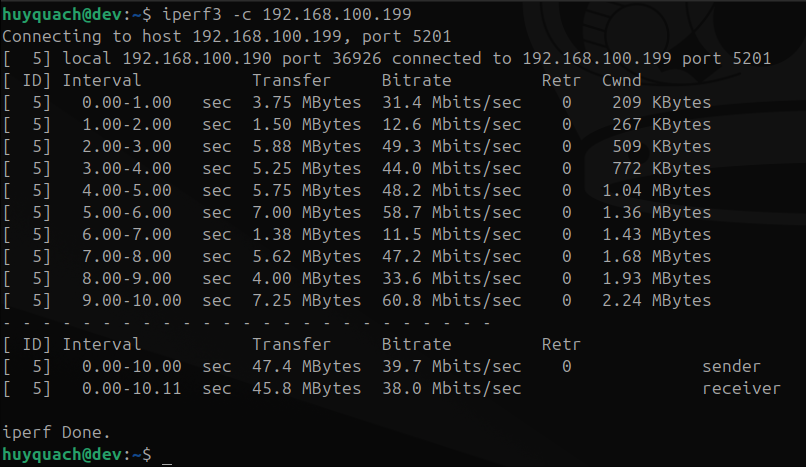
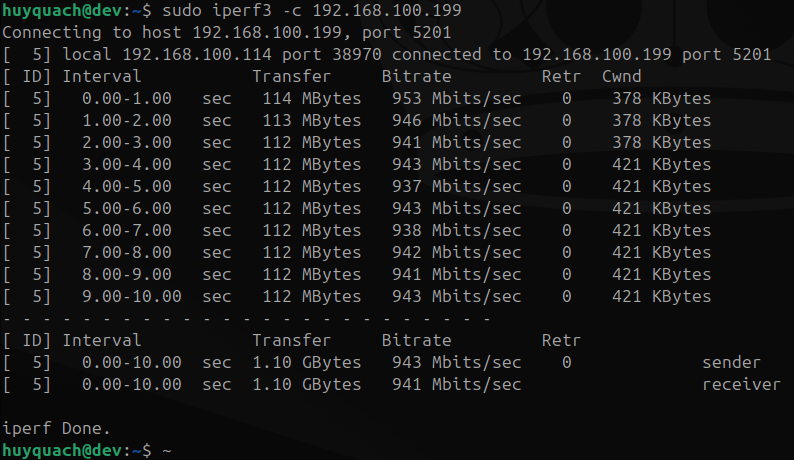

# Upgrading to a Wired Gigabit Network with an Unmanaged Switch

When moving from a pure wireless setup to a wired network for local data transfers, introducing a dedicated switch is the most cost-effective way to get true Gigabit speeds. However, adding physical hardware changes how network packets travel between your client and server, which can trigger firewall blocks, routing conflicts, and systemd mount failures if not configured correctly.

This document guides you through the process of integrating a Gigabit switch into a Homelab network, fixing the resulting edge-case errors, and benchmarking the final performance.

---

## 1. Hardware Overview & Cable Management

For this upgrade, we are using the **Tenda SG105**, a standard 5-port Gigabit Unmanaged Switch.


### Cable Plugging Strategy

Even with a simple unmanaged switch, how you plug in the cables matters due to internal hardware design:

- Keep Client and Server Adjacent: Plug the client laptop and the homelab server into ports right next to each other (e.g., Port 1 and Port 2). Cheap switches often process traffic in paired port groups; keeping your heavy-traffic devices adjacent optimizes the internal queue handling.

- Isolate the Router/A.P. Cable: Connect the uplink cable coming from your Router/Wi-Fi Access Point to the farthest port away (e.g., Port 5). This separates general external internet traffic from your intensive local data stream, reducing electromagnetic crosstalk (interference) that could otherwise force the switch to downgrade your link speed to 100Mbps.

## 2. Static IP Allocation (DHCP Reservation)

When you introduce a switch or swap from a Wi-Fi connection to a wired LAN cable, your devices communicate using different hardware network cards (MAC addresses). Your home router sees these as completely new devices and will likely assign them random new IP addresses.

To prevent your firewalls, SSH shortcuts, and NFS share configurations from breaking after every reboot, you must lock them down:

1. Access your router's admin panel (typically at 192.168.100.1).

2. Locate the DHCP Reservation or IP-MAC Binding section.

3. Bind the MAC addresses of your wired ethernet cards to permanent IPs:

    - Homelab Server (enp9s0): Locked to 192.168.100.199
    - Desktop/Laptop Client (eno1): Locked to 192.168.100.114

## 3. Homelab Server-Side Configuration (Debian 13)

### 3.1 Disabling the Server Wi-Fi

Since the server is now permanently hooked up to a high-speed Gigabit wire, its Wi-Fi card must be turned off completely.

- The Why: If both Wi-Fi and LAN are active on the same subnet (192.168.100.x), the system suffers from Asymmetric Routing. Your client might send a request over the fast LAN cable, but the server might decide to reply via Wi-Fi. The Linux kernel notices this path mismatch, treats it as a security anomaly, and silently drops the packets—causing your network shares to time out indefinitely.
- The Solution: Open the server's network configuration file:

    ```Bash
    sudo nano /etc/network/interfaces
    ```

    Comment out (add # at the beginning of) all lines related to the Wi-Fi interface (wlp7s0) to ensure it stays off after reboots:

    ```text
    # auto wlp7s0
    # iface wlp7s0 inet dhcp
    ```

    Save and apply changes by restarting the network or rebooting the server.

### 3.2 Updating the Firewall (UFW)

Our homelab follows a strict security policy. Since the client laptop now connects using its new wired IP (.114), we must grant it access through the server's firewall while maintaining the rule for its Wi-Fi IP (.190) so the client can keep its Wi-Fi on for other tasks.

Run the following commands on the server to whitelist the client's wired connection for NFS (Port 2049) and Cockpit/NPM (Port 81):

```bash
sudo ufw allow from 192.168.100.114 to any port 2049 comment 'Laptop LAN NFS'
sudo ufw allow from 192.168.100.114 to any port 81 comment 'Laptop LAN NPM Admin'
sudo ufw reload
```

### 3.3 Re-configuring NFS Exports via Cockpit

Because the server configuration is managed cleanly through Cockpit UI, the underlying /etc/exports.d/cockpit-file-sharing.exports file needs to recognize the client's new wired identity.

1. Log into Cockpit via the wired address: `https://192.168.100.199:9090`.

2. Go to File Sharing and select the shared directory /mnt/nas_storage/username.

3. In the Hosts / Allowed IPs field, append the new client wired IP 192.168.100.114 with Read/Write privileges.

4. Save and apply the changes.

## 4. Desktop/Laptop Client-Side Configuration (Ubuntu Dev)

### 4.1 Optimizing /etc/fstab Mount Parameters

To make the network mount stable and performant under the new wired architecture, we need to strip away deprecated or conflicting parameters from the client's mount profile.

Open /etc/fstab on your client machine and update the NFS entry to use this clean, resilient line:

```text
192.168.100.199:/mnt/nas_storage/huyquach /home/huyquach/NAS nfs rw,soft,timeo=150,retrans=3,rsize=1048576,wsize=1048576,noatime,_netdev,x-systemd.automount,x-systemd.device-timeout=15,x-systemd.idle-timeout=10min 0 0
```

### 4.2 Clearing Systemd Fail Caches

When a Systemd Automount unit fails due to a network timeout or a bad parameter, Systemd remembers that "failed state" and will refuse to try again even if the physical cable is fixed. We must clear its cache:

```bash
# Stop the stuck automount link
sudo systemctl stop home-usernam-NAS.automount

# Forcefully unmount any ghost connections
sudo umount -f -l /home/username/NAS

# Force systemd to reload the edited fstab file
sudo systemctl daemon-reload

# Clear the "Failed State" history from memory
sudo systemctl reset-failed home-username-NAS.mount

# Restart the automount unit cleanly
sudo systemctl start home-username-NAS.automount
```

## 5. Benchmarks & Results (Before vs. After)

To measure the impact of the Gigabit Switch integration, we performed raw network throughput testing and tracked a real-world transfer of a 1.5GB RAR file.

### 5.1 Raw Network Capacity (iperf3)

o test the raw network bandwidth without any disk I/O bottlenecks, `iperf3` was executed using the following commands:

- **Server Side (Homelab Vaio):** Start the listener daemon.

  ```bash
  iperf3 -s
  ```

- Client Side (Ubuntu Desktop): Run the benchmark against the server's wired IP.

    ```bash
    iperf3 -c 192.168.100.199
    ```
  
Before fixing the physical cable placement and isolating the router uplink, the switch negotiation was throttled, locking the network into Fast Ethernet mode (100Mbps limit). After optimization, the bandwidth scaled up to its theoretical limit.

<table width="100%">
  <tr>
    <td width="50%" align="center"><b>Before Optimization (Throttled 100Mbps)</b></td>
    <td width="50%" align="center"><b>After Optimization (True Gigabit)</b></td>
  </tr>
  <tr>
    <td></td>
    <td></td>
  </tr>
</table>

## 5.2 Real-world File Transfer (dstat -cdng)

To monitor system resource footprints and actual write performance during the transfer of the 1.5GB RAR archive, the following commands were used:

```bash
sudo dstat -cdng
```

Track live CPU, Disk, and Network stats.


**Conclusion**: The network bottleneck has been completely eliminated. The system is now entirely **I/O Bound**, limited only by the mechanical spin rate of the server's storage drive. The setup is highly stable, secure under a zero-trust firewall policy, and gracefully survives full system reboots.
